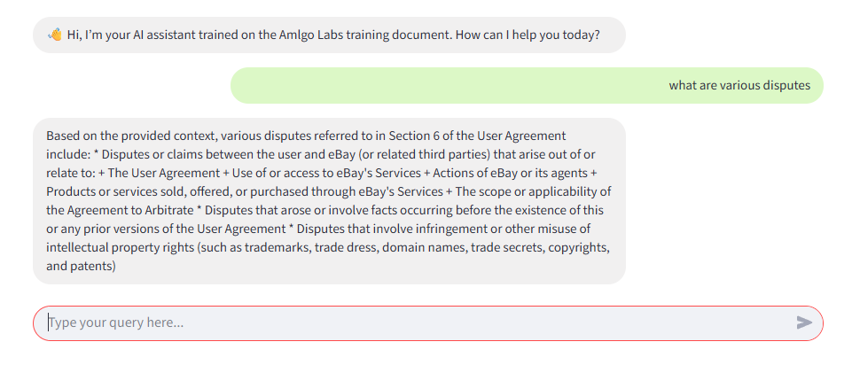

# 📘 Amlgo Labs RAG Chatbot
This project is a **Retrieval-Augmented Generation (RAG) chatbot** built as part of the **Junior AI Engineer assignment at Amlgo Labs**.
The chatbot answers user queries based on the provided **AI Training Document** by combining semantic search with a large language model (LLM).
It features a clean **Streamlit UI** with real-time streaming responses and transparent source retrieval.
---

## 🚀 Features

* 📄 **PDF Ingestion & Chunking** → Splits document into semantic chunks for efficient retrieval
* 🧠 **Embeddings + FAISS Vector DB** → Stores & searches document knowledge
* 🤖 **LLM Integration** → Uses **LLaMA 3.1 Instruct** from HuggingFace for grounded responses
* 🔎 **RAG Pipeline** → Retrieves context + generates answers in one flow
* ⚡ **Streaming Responses** → Token-by-token response simulation for a natural feel
* 💬 **Modern Chat UI** → WhatsApp-like chat bubbles, assistant left & user right
* 📑 **Source Transparency** → Shows retrieved context chunks used in answers

---

## 📂 Project Structure

```
rag-chatbot-amlgo/
│── data/                # Original AI Training Document
│── chunks/              # Processed text chunks (optional)
│── vectordb/            # Saved FAISS DB (optional)
│── notebooks/           # Preprocessing & experiments
│── src/                 # Retriever, generator, pipeline scripts
│── app.py               # Streamlit app (UI)
│── requirements.txt     # Project dependencies
│── README.md            # Documentation
│── report.pdf           # Technical report (2–3 pages)
│── assets/              # Screenshots & demo GIF/video
```

---

## ⚙️ Installation

Clone the repository:

```bash
git clone https://github.com/Poky24/rag-chatbot-amlgo.git
cd rag-chatbot-amlgo
```

Install dependencies:

```bash
pip install -r requirements.txt
```

Set up your **HuggingFace API key** inside a `.env` file:

```
HUGGINGFACEHUB_API_TOKEN=your_token_here
```

---

## ▶️ Running the Chatbot

```bash
streamlit run app.py
```

The app will open in your browser at `http://localhost:8501`.

---

## 🎨 UI Preview

* ✅ First message greeting from assistant
* ✅ Chat bubbles (assistant left, user right)
* ✅ Streaming token-by-token responses
* ✅ Sources shown in expandable panel

[Demo Video 1](https://drive.google.com/file/d/1ql4oWr_fxLQ7KU9hFtJt-f0zfZpR2DqB/view?usp=drive_link)  
[Demo Video 2](https://drive.google.com/file/d/1K-sOs4JQX883rqVc3HiceTaFdelYV2IT/view?usp=drive_link)


---

## 📊 Example Queries

**Q1:** *"What is the purpose of this training document?"*
**A1:** "This document is intended to introduce AI fundamentals and guide employees at Amlgo Labs through ..."

**Q2:** *"Who created this chatbot?"*
**A2:** "I was created by Pulkit as part of an assignment for Amlgo Labs."

**Q3 (failure case):** *"Tell me about IPL 2024 winners."*
**A3:** "This is not related to the training document I was trained on."

---

## 📑 Report

The **report.pdf** (included in repo) explains:

* Document structure & chunking logic
* Embedding model choice & FAISS vector DB
* Prompt format & pipeline flow
* Example queries (success + failure)
* Notes on hallucinations & limitations

---

## 📌 Notes

* The chatbot answers **only from the provided document**.
* If the context is missing, it politely responds that the answer is not covered.
* Streaming is simulated word-by-word for smooth UX.

---

## 🏢 Author

Developed by **Pulkit Chauhan** as part of the **Junior AI Engineer Assignment** at **Amlgo Labs**.

---

✅ This README matches exactly what they asked in the PDF: overview, setup, usage, screenshots, demo, report, and notes.

---

Do you want me to also **draft your `report.pdf` (2–3 pages)** now so you’ll have everything ready for submission?
